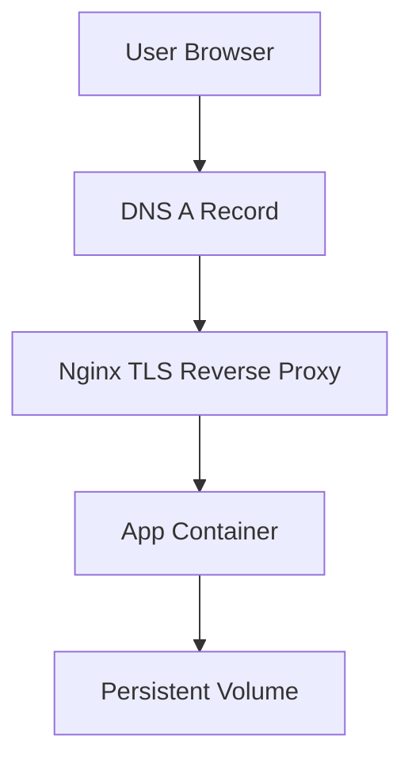

# Architecture

The baseline follows a standard VPS deployment pattern: public-facing nginx handling TLS, proxying to a local-only container.

## Components

- **Nginx**: TLS termination (Let's Encrypt), HTTP→HTTPS redirect, reverse proxy to app
- **Docker Compose**: Single-container app stack, binds to 127.0.0.1 only
- **UFW**: Firewall allowing 22/80/443, deny everything else
- **SSH**: Key-only auth, root login configurable
- **Backups**: Daily systemd timer at 02:30, 7-day retention

## Security Model

App container never exposed directly - nginx proxies on 127.0.0.1:5678. UFW blocks all inbound except SSH/HTTP/HTTPS. SSH requires keys, no passwords.

State tracked in `/opt/linux-server-baseline/.deploy-state` as JSON for rollback support.
