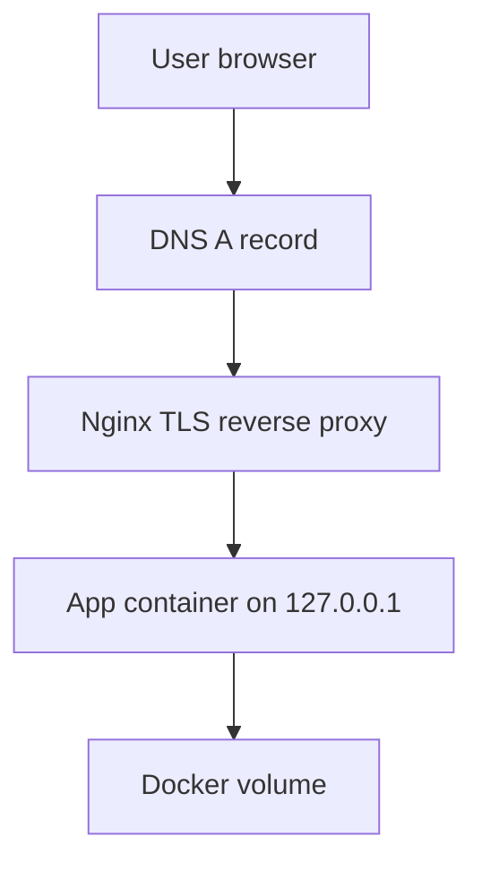

# Architecture

The baseline follows a standard single-VPS deployment pattern: public-facing Nginx terminates TLS and proxies traffic to a container bound on localhost.

```mermaid
flowchart TD
  U["User browser"] --> D["DNS A record"]
  D --> N["Nginx TLS reverse proxy"]
  N --> A["App container on 127.0.0.1"]
  A --> V["Docker volume"]
```

## Components

- **Nginx**: TLS termination with Let's Encrypt, HTTP-to-HTTPS redirect, reverse proxy to app
- **Docker Compose**: Single-container app stack, binds to 127.0.0.1 only
- **UFW**: Firewall allowing 22/80/443, deny everything else
- **SSH**: Key-only auth, root login configurable
- **Backups**: Daily systemd timer at 02:30, 7-day retention by default

## Security Model

The app container is not exposed directly. Nginx proxies to `127.0.0.1:5678`, UFW blocks inbound traffic except SSH/HTTP/HTTPS, and SSH password authentication is disabled.

State tracked in `/opt/linux-server-baseline/.deploy-state` as JSON for rollback support.
